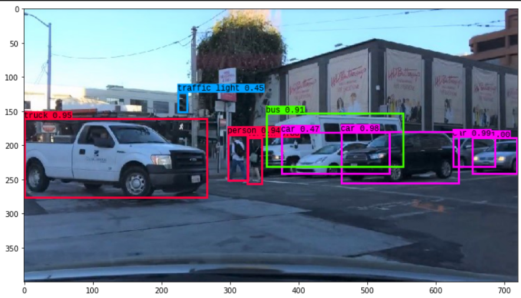

# Object_Detection

**Primary Objective and Team Considerations**

The primary objective going into this project was to build an object detection algorithm that self-driving cars can use to safely navigate the roads with optimal performance.

Our team initially considered approaching this problem from a CNN standpoint since we were aware of how it involved multiclass classification. At that point, we weren't too familiar with region-based CNNs or open-source neural networks like DarkNet, so we wanted to try building and training a simple model and see what percentage of images it was able to classify correctly.

We primarily used 2 datasets, the first one being CIFAR10 and the second one being ImageNet. We initially used CIFAR10 to build a simple image classifier that could predict the probability of an input image being a car or a truck. As far as using ImageNet, we utilized a pre-trained CNN known as VGG16 that has been trained on millions of images from the ImageNet database and used it with a custom neural network that we built from scratch. We were overall able to achieve an accuracy of about 94.3 percent on the testing dataset.

**Algorithm Employment**

Since this problem involved object detection for autonomous vehicles, we wanted to build and train a model that could help us achieve as high of an accuracy as possible. As a result, we utilized multiple algorithms along the way as a means of gauging which one delivered the highest accuracy. Overall there were 4 different ones that we used and those were:

1. 2-layer Convolutional Neural Network

We first built a simple 2-layer neural network and trained the model on a cars and trucks dataset for about 20-30 epochs. To check the accuracy of the model, we normalized the data to speed up convergence before fitting it to the network and also converted all class labels into a one-hot encoded vector. Our model achieved an accuracy of almost 96.2% on the training dataset, but only 74.3% on the testing dataset. We observed that the model was overfitting quite a bit, so we wanted to try a different algorithm to check if we could increase the accuracy of the image classifier.

2. Sliding Window Algorithm

We modified the original image classifier to perform object detection on a more advanced scale by making it iterate through cropped windows of a fixed size in the input image, savig those windows in a custom numpy array, and using an MLP to make predictions whether the window contains a car, truck, or any other extraneous image. We trained the model in such a way that it was able to not only provide us with its class label prediction, but also a confidence level for the prediction, which we made use of as we attempted to check the relative accuracy of the neural network. Our custom CNN and the MLP both gave us an accuracy of about 57.8%, and thought that both our networks weren't fine tuned enough to provide a high accuracy. We once again wanted to experiment with a different algorithm to check if our accuracy could go up further.

3. Transfer Learning model

We were still interested in training a CNN that could be fairly confident in its image predictions, so we used a transfer learning model known as VGG16, which has been trained on millions of images from the ImageNet database. We loaded it in, passed it into a custom neural network we created, and trained it for about 20-30 epochs. We were able to achieve an accuracy of almost 96.9% on the testing datset and about 98.7% on the training dataset, but when we implemented the sliding window algorithm from earlier on it, we were still getting the same relative accuracy, and were fairly confident that we did not optimize the model properly once again even though we made sure to include more dropout and dense layers.

4. YOLO(DarkNet)

We then used an algorithm known as YOLO for object detection/classification since we were once again experimenting with different models. We essentially pased an input image into a single-layer deep CNN known as DarkNet that is based on VGG16, and modeled a processor that would give us bounding box predictions based on which objects were present in the frame. Since our model could make detections on different scales, we wanted to extend our algorithm to a real-time situation, which in our case was a video. We were able to fine tune our container and NMS thresholds enough as for the model to be able to filter out bounding boxes and only detect the ones that are sufficiently visible in the frame.

Here's our algorithm being empoyed in a real world scenario:
)

